1. how to write tests and extensions using JUnit 5?
2. What is the JUnit Platform and why do we need it?
3. What's still to come and how to get started?
4. 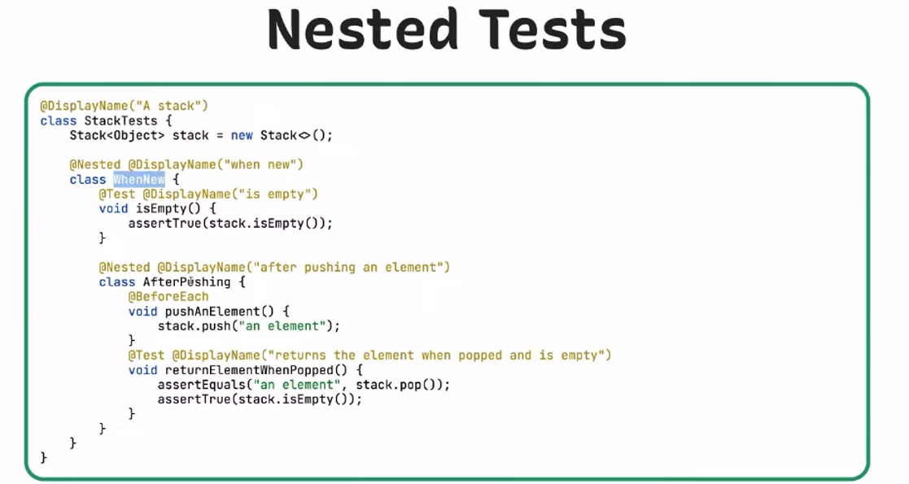
5. 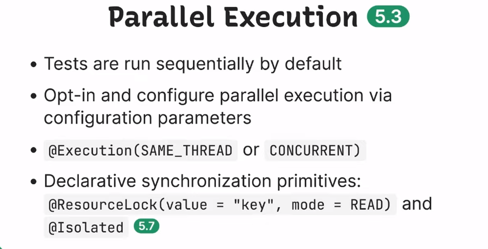
6. https://github.com/sgurung007/junit5-demo.git
7. 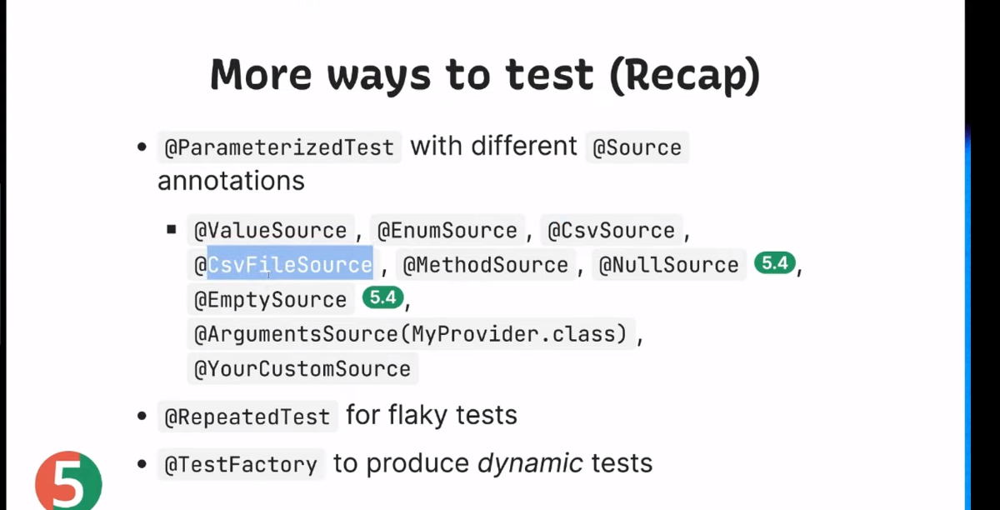
8. 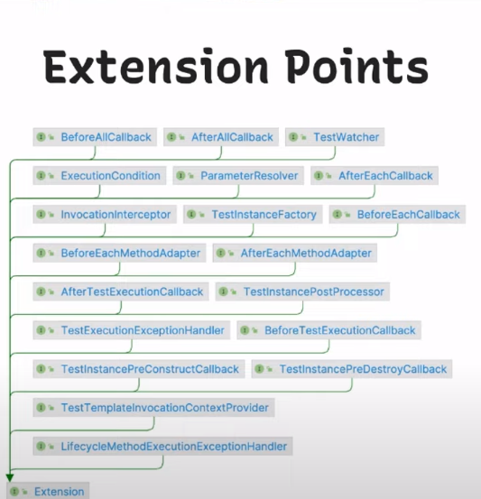
9. 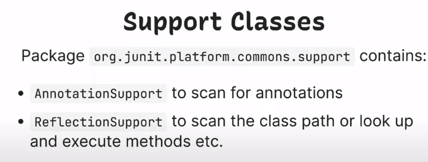
10. 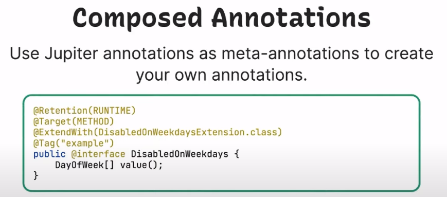
11. 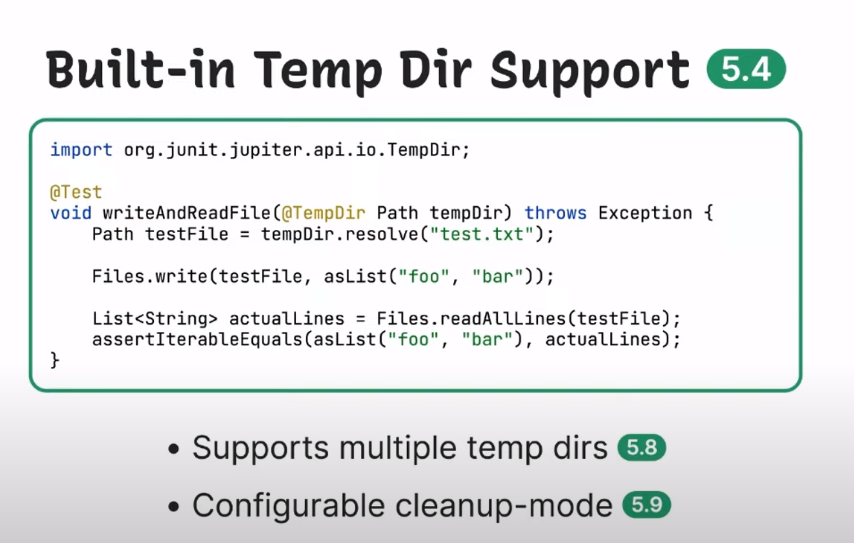
12. 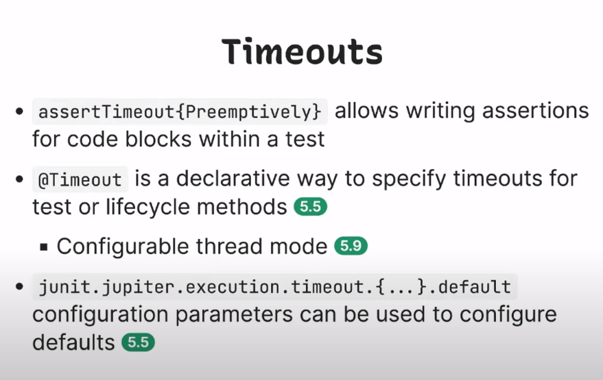
13. 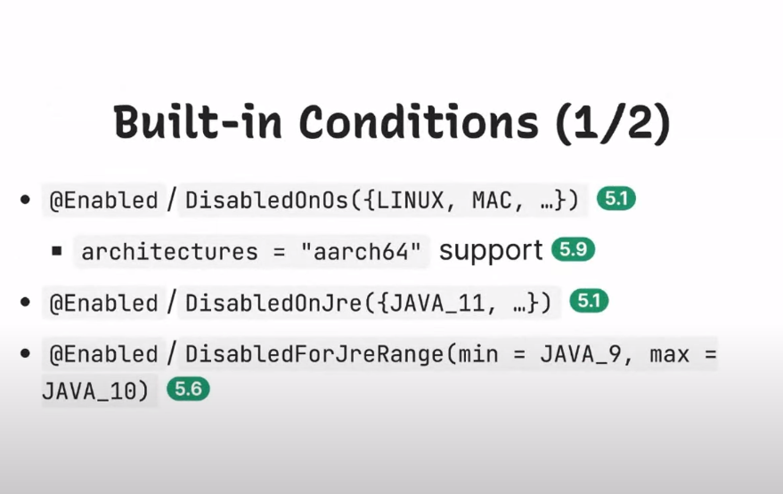
14. 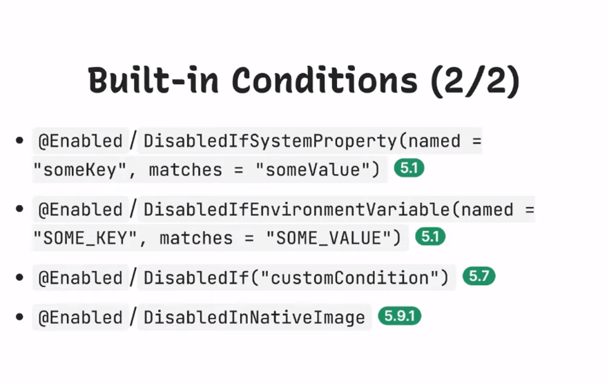
15. 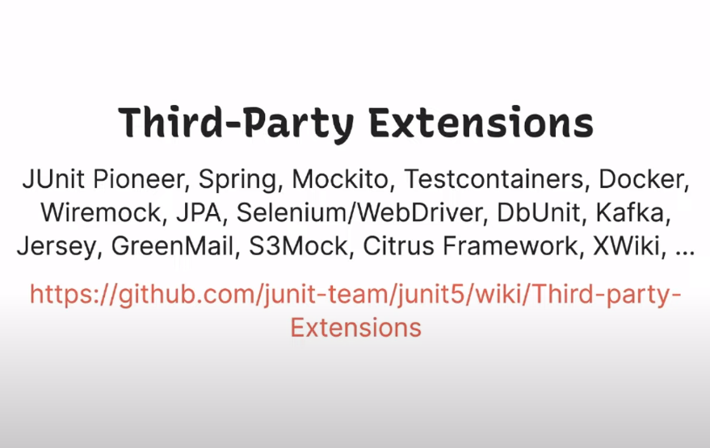

### JUnit Platform
* Separation of Concerns
   * An API to write tests and extensions (Jupiter API)
   * Extensible mechanisms to discover and execute tests (Test Engine SPI)
   * An API for test execution by tools (Launcher API)
* JUnit 5= Jupiter+Vintage+Platform
* 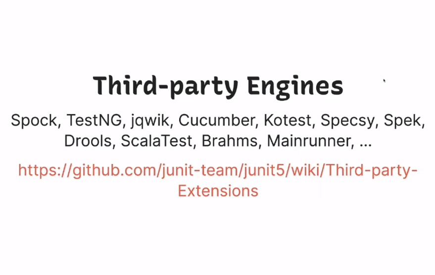
* Demo: junit5-multiple-engines on GitHub
* 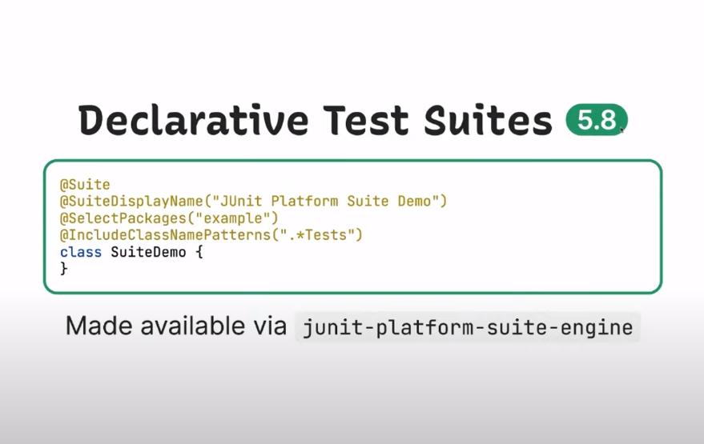
* 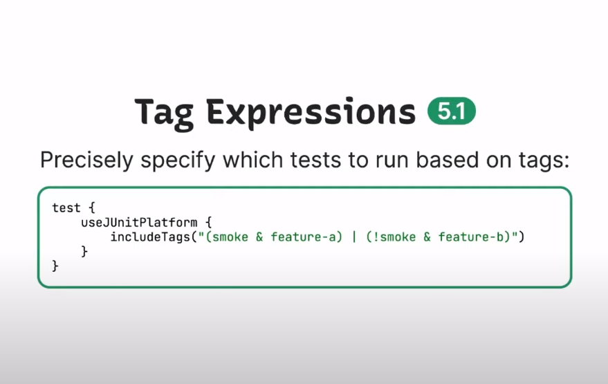
* 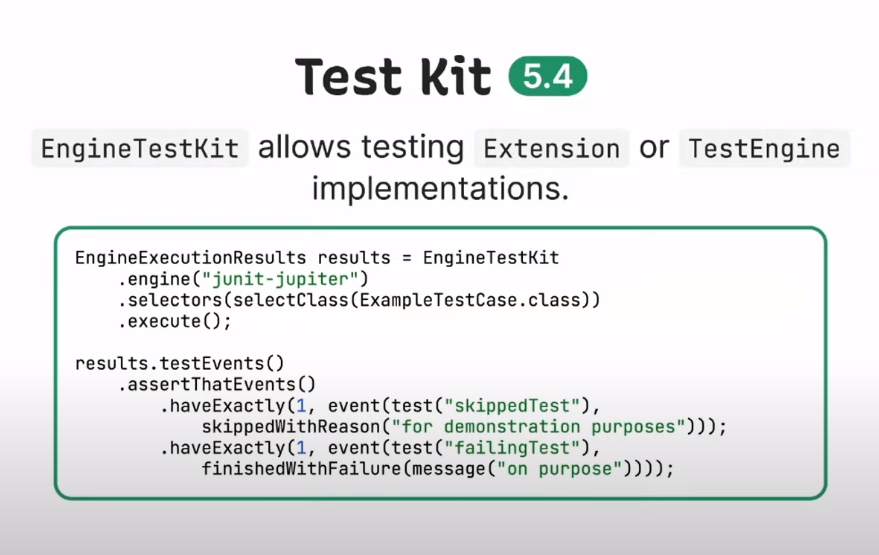
* 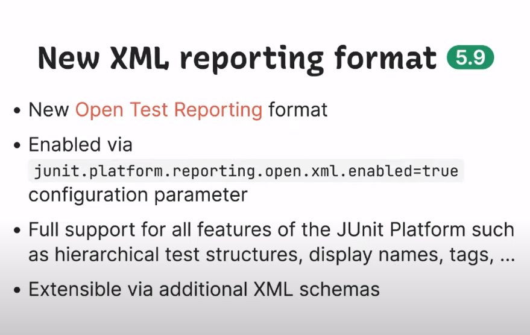
* 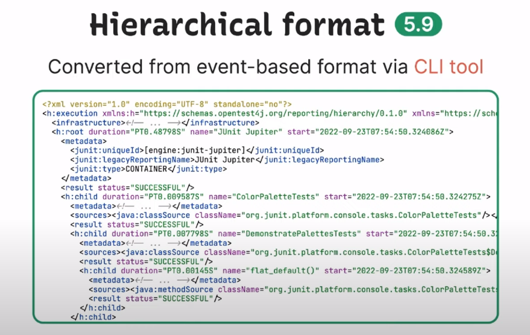
* 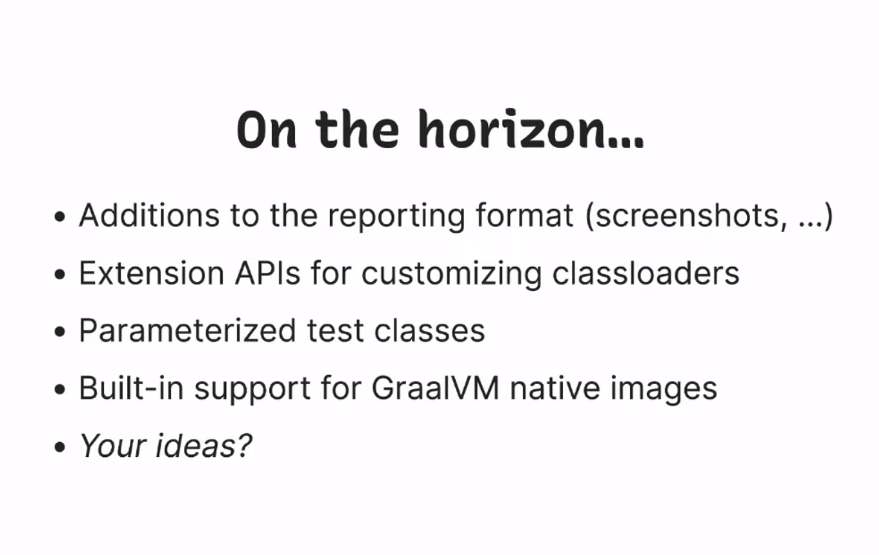